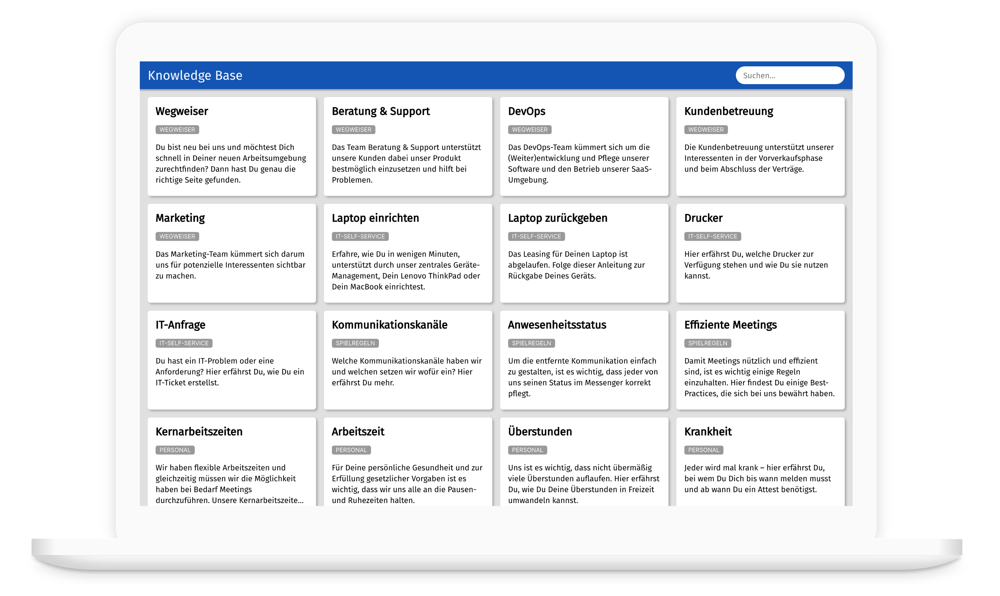

# Coding Challenge: Knowledge Base Frontend

Ziel der Aufgabe ist es, ein Frontend zur Anzeige von Artikeln aus einer fiktiven Knowledge Base mit einfacher Suchmöglichkeit zu entwickeln.

## Prototypen
Zur Veranschaulichung der Funktionalität und zur Vorgabe des Designs existieren zwei Design-Prototypen:

- [Desktop-Prototype](https://framer.com/share/Coding-Frontend-Developer-v2--kPA0Yka2XNBzvHmDgWrK/VfUK15NXl)
- [Mobile-Prototype](https://framer.com/share/Coding-Frontend-Developer-v2--kPA0Yka2XNBzvHmDgWrK/cQkg7Br8G)

Beachte, dass die Prototypen nur der Veranschaulichung dienen und keine Produktionsreife Umsetzung darstellen.

## Backend
Das Backend ist über eine REST-API erreichbar:

- [Dokumentation der Backend-REST-API](https://documenter.getpostman.com/view/258409/TVzSjHFC)

## Fachliche Anforderungen
Im Folgenden werden die fachlichen Anforderungen beschrieben, die Deine Implementierung erfüllen soll.

### Allgemeine Anforderung
1. Aufbau und Design der App entsprechen dem Prototyp.
2. Die Darstellung ist responsiv.

### Darstellung
1. Artikel aus der Knowledge Base werden als Karten in der Benutzeroberfläche dargestellt.
2. Jede Karte enthält folgende Informationen des Artikels:
	1. Titel
	2. Kategorie
	3. Teaser-Text
3. Die Karten sind in Zeilen angeordnet. Die Anzahl der pro Zeile dargestellten Karten hängt von der Breite des Browsers ab. Auf einem Smartphone wird nur eine Karte pro Zeile dargestellt.
4. Passen nicht alle Karten auf den Bildschirm kann ich vertikal scrollen.
5. Die Darstellung berücksichtigt variable Textlängen.

### Ladeverhalten
1. Findet ein Ladevorgang statt, so wird eine Platzhalterkarte wie im Prototyp dargestellt.

### Filtern
1. Ich kann die Artikelliste über einen Suchbegriff eingrenzen. Das Backend liefert Artikel, deren Titel, Teaser-Text _oder_ Kategorie den Suchtext enthalten.
2. Durch Klick auf die Kategorie einer Karte wird der Kategoriename ins Suchfeld übernommen. Dadurch wird eine Suche ausgeführt, als wenn ich den Text manuell dort eingegeben hätte.
3. Existieren keine Artikel die den Filterkriterien entsprechen, so wird ein Platzhalterinhalt wie im Prototyp dargestellt

## Technische Anforderungen
1. Implementiere die Anwendung in TypeScript mit React
2. Schreibe _Unit_-Tests um die Funktionsfähigkeit der Artikelliste sicherzustellen
3. Stelle den Code als Git-Repository auf einer Plattform Deiner Wahl zur Verfügung
